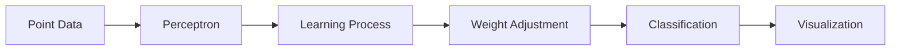

# 🤖 Perceptron Implementation

## 🎯 About the Project
This project implements a perceptron, a fundamental machine learning algorithm used for classifying linearly separable data. The project demonstrates:

- 🧠 Practical implementation of a perceptron
- 💻 Programming in Java
- 📊 Visualization of the learning process
- 🔍 Testing on real-world data

---

## 🌟 Main Components

📦 **Perceptron Project**
```
 ┣ 📜 Perceptron.java
 ┣ 📜 Point.java
 ┗ 📜 Main.java
```

### 🔹 **Perceptron.java**
✅ Implementation of the perceptron algorithm
✅ Learning and prediction functions
✅ Management of weights and learning rate

### 🔹 **Point.java**
✅ Representation of data points
✅ Storage of x, y coordinates
✅ Determination of point class

### 🔹 **Main.java**
✅ Demonstration of the perceptron's operation
✅ Generation of test data
✅ Visualization of results

---

## 💡 Key Features



### 📊 **Perceptron Algorithm**
✅ Initialization of random weights
✅ Implementation of the activation function
✅ Adaptive learning process

### 🎯 **Data Processing**
✅ Handling of 2D points
✅ Binary classification
✅ Normalization of input data

### 📈 **Visualization**
✅ Displaying points
✅ Drawing the separating line
✅ Tracking the learning process

---

## 🛠️ Technologies
| **Technology** | **Application** |
|--------------- |-----------------|
| Java ☕       | Programming language |
| Perceptron 🤖 | Machine learning algorithm |
| Graphics 📊    | Visualization of results |

---

## 📚 Knowledge Gained

### **Machine Learning Concepts**
- 📌 Understanding how a perceptron works
- 📌 Implementing the learning process
- 📌 Optimization of learning parameters

### **Programming Skills**
- 📌 Object-oriented approach to implementation
- 📌 Management of input data
- 📌 Visualization of results

### **Practical Applications**
- 📌 Data classification
- 📌 Model testing
- 📌 Analysis of results

---

## 🎓 Summary
The **Perceptron** project is a practical implementation of a basic machine learning algorithm that showcases:

✨ Understanding of machine learning concepts
🏗️ Ability to implement ML algorithms
🔍 Practical application in data classification
📈 Visualization of the learning process

🚀 The project includes a full implementation with usage examples and visualization! 🔗
